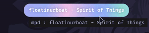

# Caway

[Cava](https://github.com/karlstav/cava) module for [Waybar](https://github.com/Alexays/Waybar)



## Dependencies:
- Cava
- Waybar
- playerctl
- Font that support [unicode](https://en.wikipedia.org/wiki/Unicode_font) U+2581 to U+2588 (▁▂▃▄▅▆▇█)

## Installation
Download `caway` and put it in your config/ module/script folder.

## Usage
```
caway usage: caway [ options ... ]
where options include:

  -b <integer>  (Number of bars to display. Default 8)
  -f <integer>  (Framerate of the equilizer. Default 60)
  -e            (Disable equilizer. Default enabled)
  -h            (Show help message)
```

## Example

- Change `exec` value to `<script path> <arguments>`.

```jsonc
"custom/music": {
    "format": "{icon}{}",
    "format-icons": {
        // "Playing": " ", // Uncomment if not using caway
        "Paused": " ",
        "Stopped": "&#x202d;ﭥ " // This stop symbol is RTL. So &#x202d; is left-to-right override.
    },
    "escape": true,
    "tooltip": true,
    "exec": "~/.scripts/caway",
    "return-type": "json",
    "on-click": "playerctl play-pause",
    "on-scroll-up": "playerctl previous",
    "on-scroll-down": "playerctl next",
    "on-click-right": "g4music",
    "max-length": 35
}
```

## Style
```css
#custom-music.Playing {
    background: rgb(137, 180, 250);
    background: radial-gradient(circle, rgba(137, 180, 250, 120) 0%, rgba(142, 179, 250, 120) 6%, rgba(148, 226, 213, 1) 14%, rgba(147, 178, 250, 1) 14%, rgba(155, 176, 249, 1) 18%, rgba(245, 194, 231, 1) 28%, rgba(158, 175, 249, 1) 28%, rgba(181, 170, 248, 1) 58%, rgba(205, 214, 244, 1) 69%, rgba(186, 169, 248, 1) 69%, rgba(195, 167, 247, 1) 72%, rgba(137, 220, 235, 1) 73%, rgba(198, 167, 247, 1) 78%, rgba(203, 166, 247, 1) 100%);
    background-size: 400% 400%;
    animation: gradient_f 9s cubic-bezier(.72, .39, .21, 1) infinite;
    text-shadow: 0px 0px 5px rgba(0, 0, 0, 0.377);
    font-weight: bold;
    color: #fff;
}

#custom-music.Paused,
#custom-music.Stopped {
    background: #161925;
}
```

## Credits
- [ray-pH/polybar-cava](https://github.com/ray-pH/polybar-cava): `caway` extends its functionality with playerctl
